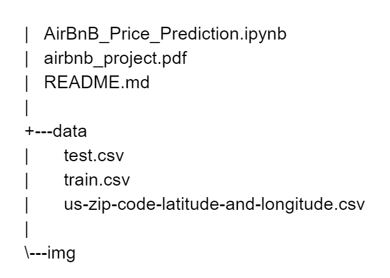
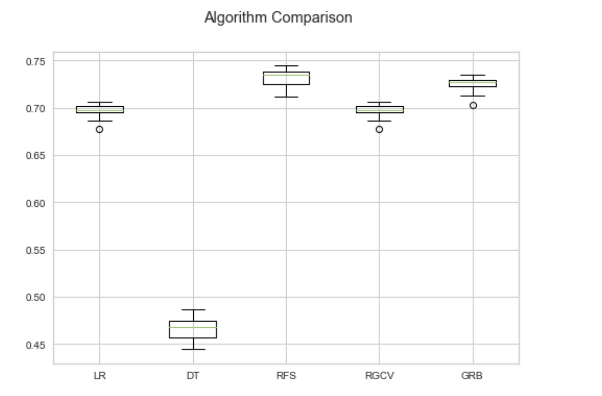

# AirBnB Price Prediction

**[Mahshid AMIR MOAZAMI]**

*Data Analytics full-time Paris Jan 2021*

## Overview

The aim of this project was to predict the price of AirBnB listings in major U.S. cities. 
Instructions:

* Build a model with the training data (train.csv) that predicts the variable "log_price"

* Run the model on the test dataset (test.csv) to generate predictions in the format found in the sample submission (sample_submission.csv)

Data source:
- [AirBnB listings in major US cities](	https://www.kaggle.com/rudymizrahi/airbnb-listings-in-major-us-cities-deloitte-ml)

Datasets :

	* train.csv . : Training data
	* test.csv . : Test data

The training data for the project consist of the following columns:

- id : Record identifier
- log_price : log(price) [The logarithm used is natural log]
- ….. : 27 features for the listing

### Technologis used:

- [Scikit learn](http://scikit-learn.org/stable)
- [Pandas](http://pandas.pydata.org/)
- [Numpy](http://www.numpy.org/)
- [Jupyter Notebook](http://jupyter.org/)
- [Matplotlib](http://matplotlib.org/)
- [Seaborn](http://seaborn.pydata.org/)
- [Scipy](https://www.scipy.org/)
- Regression Models
	+ Linear Regression
	+ Ridge Regression
	+ Decision Tree
	+ Random Forest Regressor

## Organization
In repository of project you find:

## Model Training and Evaluation

During the modelling, we see that the performance were way better on Random forest model, compare to other models with the metrics(Rscore) = 0.732148.

## Conclusion
Model comparaison

